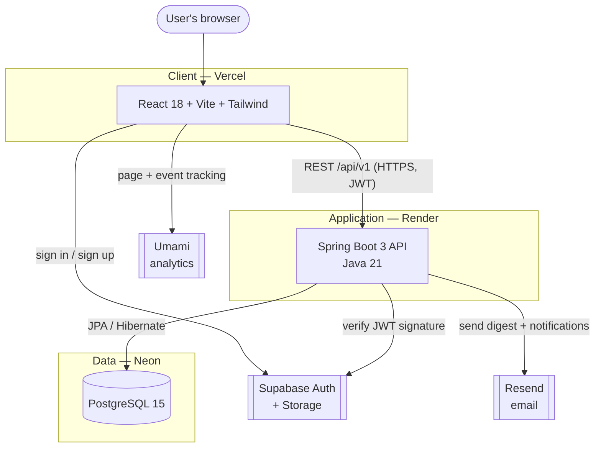

# Architecture

JavaCup is a three-tier web application. Each tier is deployed independently and runs on a
free hosting tier at launch. All communication between tiers is over HTTPS.

## The three tiers

| Tier | Technology | Hosting | Responsibility |
| --- | --- | --- | --- |
| Client | React 18 + Tailwind CSS (Vite) | Vercel | Render the UI, handle routing, consume the REST API, hold the auth token via the Supabase JS client. |
| Application | Spring Boot 3 + Java 21 (Maven) | Render | Expose the REST API, enforce business logic, validate Supabase JWTs, talk to the database and external services. |
| Data | PostgreSQL 15 | Neon | Persist all application data. Spring Data JPA / Hibernate is the ORM. |

A key design point: **the backend talks to Neon directly for all application data.** It
does not route data through Supabase. Supabase is used only for authentication and avatar
storage. This keeps the data layer under the application's direct control and avoids
coupling business data to the auth provider.

## System diagram

## External services

| Service | Provider | Free tier | Purpose |
| --- | --- | --- | --- |
| Auth + Storage | Supabase | 50k MAU / 1GB | Email + Google OAuth, JWT issuance, avatar storage |
| Email | Resend | 3,000 emails/mo | Weekly digest, reply notifications, welcome emails |
| Analytics | Umami (self-hosted) | Free on Render | Privacy-respecting page and event tracking, no cookie consent needed |
| CI / CD | GitHub Actions | Free (public repo) | Lint, test, build on every push; deploy on merge to main |

## Request and data flow

A typical authenticated request:

1. The user signs in through the React client, which calls Supabase directly. Supabase returns a JWT.
2. The client stores the session (handled by the Supabase JS library) and includes the JWT as a `Bearer` token on API calls.
3. A request hits the Spring Boot API. A security filter validates the JWT's signature and expiry, extracts the user's UUID from the `sub` claim, and sets the security context.
4. The controller handles the request, using Spring Data JPA to read or write in Neon.
5. The response returns as JSON.

The full authentication sequence is documented in [authentication.md](./authentication.md).

## How the auth identity links to application data

Supabase owns the `auth.users` table in its own database. JavaCup's application tables live
in a separate Neon database. Because these are two different databases, **application rows
cannot hold a real foreign key to the Supabase users table.**

Instead, every application row that belongs to a user stores the Supabase user UUID in a
plain `user_id UUID` column with no foreign-key constraint. The link between a JavaCup
profile and a Supabase user is an application-level invariant, enforced in code, not by the
database. This is the single most important thing to understand about the data model — see
[database.md](./database.md) and
[decisions/0001-supabase-for-auth.md](./decisions/0001-supabase-for-auth.md).

## Design system

All design tokens — colours, typography, spacing, radius, shadows, components — are defined
in the **Brand Identity** document, which is the single source of truth for the frontend's
visual language. This architecture document does not restate them; the frontend's Tailwind
configuration is generated from those tokens.
