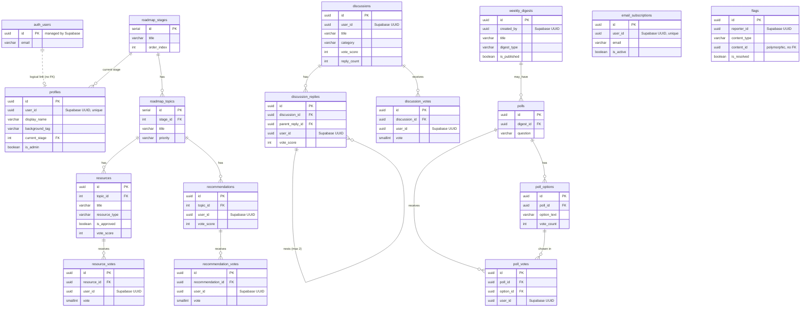

# Entity-Relationship Diagram

This is the entity-relationship diagram for the JavaCup database. It renders automatically
on GitHub. For the full column-level detail of each table, see [database.md](./database.md).

## Reading this diagram

- Solid lines are real foreign-key relationships enforced by the database.
- The Supabase `auth.users` table is shown for context but lives in a **separate database**. The dashed link to `profiles` is a **logical** link via the stored user UUID — it is not a database foreign key. Every other table that stores a user UUID has the same kind of logical, code-enforced link, omitted here to keep the diagram readable.

The `email_subscriptions` and `flags` tables have no enforced foreign-key relationships to
other application tables (they link by user UUID and by polymorphic `content_id`
respectively), so they appear in the diagram as standalone entities.
